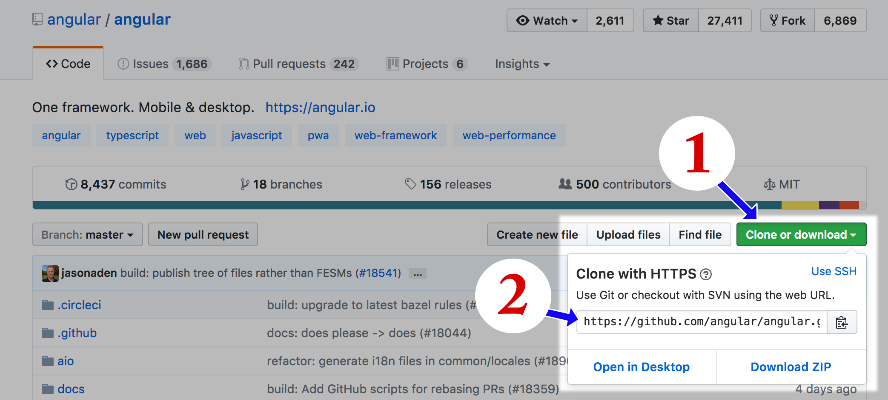
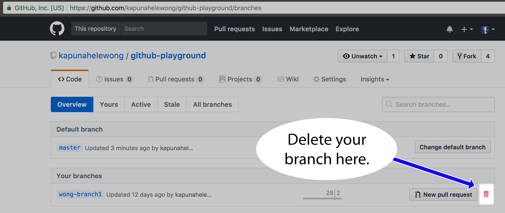

# Workflow for editing Angular docs

<!-- This doc captures Denny's understanding of the workflow. **KW and others, please edit to add missing info and correct mistakes.** -->

This doc is for a tech writer who wants explanations and instructional prose on each of steps required for working on the Angular docs. If you're looking for just the commands and a minimum of explanation, see [Angular.io local setup](setting-up-angular.md).

This assumes:
* You have a GitHub account.
* You have installed `node, npm, and yarn`. See [Installations](/installations.md).
* You have installed Visual Studio Code (VSC) and configured the PATH variable so you can open VSC from the command line. See [Installations](/installations.md).

## Section 1: Initial setup for a new story

For purposes of this doc, a story is a logical collection of documentation tasks that fit together. Usually, a story is completed by editing in a branch. That is, one story = one branch.

### Step 1.1: Fork the angular/angular repo

_If you've already forked the repo or are working from a group fork, skip this step and go to the next one._

This creates a repo in your account. e.g. dennispbrown/angular by creating a copy of angular/angular. You have to fork someone else's repo you want to work on because you have read only permissions on it by default. The owner can give you 
more permissions, but working with the least possible is the safest route. You fork on the GitHub website by clicking the fork button on the upper right of the repo you'd like to make a copy of.

### Step 1.2: Clone the repo

_Skip this if you already have a local copy of angular.io._

This creates a copy of the repo, aka a clone, locally that you'll use for this story. 

* In Terminal, `git clone url-to-the-repo`.

Get the URL to the repo by clicking on the green button (1) and then copying it to your clipboard (2): 

### Step 1.3: Create a branch

This creates a local copy of a branch for you to work in. This isn't on GitHub until you push up later. 

* In Terminal, `git checkout -b name-of-your-new-branch`

## Section 2: Daily Setup

This section assumes that you'll work on a story (branch) over a few days. 

### Step 2.1: Rebase your branch(es)

This makes sure you have the most recent changes that are in master in your feature branches. You do this because you want your branches to be as close as possible to the master branch with the only differences being your edits. In order to merge your branch with the master branch, your branch will have to be up-to-date. If it isn't, the owner of the repo will ask you to rebase. If you've been rebasing all along, it should be an easy task. If you haven't, it will be more involved (read: rebase often!!).

The commands to rebase are:

* On master: `git pull`. 
* On your branch: `git rebase origin/master`

_Note_: `git pull` _is actually two commands&mdash;a fetch and a merge. There may be times when you don't want to merge. In that case, you just do a `git fetch`, a harmless command that simply goes out and gets the most recent changes to the repo. You won't need to apply this knowledge right away, but the longer you work on the docs, more likely the occasion is to arise. So keep this note in the back of your mind._

#### Conflicts
Sometimes when you rebase, you'll run into conflicts. To fix them, open the file(s) specified in the conflict message in your editor and edit the files so that they include the changes you intend. 

1. Follow steps 5-7 in [this GitHub help doc](https://help.github.com/articles/resolving-a-merge-conflict-using-the-command-line/). 
2. When you've finished editing all the conflicts and saved your file(s), enter this at the command line `git rebase --continue`.

_Note: If you squash your commits before rebasing, you may save yourself some work. If you have, for example, 20 commits, they could all potentially cause conflicts when you attempt a merge. Git merges each commit separately, so you could get conflicts over and over as you step through. You'll feel like you're done resolving conflicts only to watch more show up as git applies the next commit. Do yourself a favor in these situations and keep your commits as few in number as possible._

### Step 2.2: Run yarn

This turns on the compiler that watches your local folder for changes, translates the markdown to html, and displays the result in your browser.

In terminal:
1. `yarn start`.
Leave this window open. Yarn is now running in the background. Don't ^C out of this command until you're done for the day. And you might even keep it running over multiple days.
1. Open a new tab or window in Terminal.
1. `yarn docs-watch`
Again, leave this window open. The watcher is running in the background. 
1. Open a third tab or window in Terminal.
Use this screen for git commands as you work.

_Note: If you change branches, it's likely that one of the `yarn` commands will exit. Just restart it. If things still aren't rendering correctly in the browser, exit both of the commands and restart them._

## Section 3: Daily Work

This section assumes:
* You are working in a local branch.
* You have `yarn` running.

### Step 3.1 - Open VSC with files you want to work on

Quick version: In a Terminal window, `cd` to the directory you are working in, enter the command `code .` This opens all of the files in that directory.

Longer version that you might be used to: Open VSC from the Finder, navigate to the right folder, and open the files/folders you want. 

### Step 3.2 - Edit files

That is, do the real work that you have wanted to do all along.

You can create new files, edit files, delete files, etc. Save them as you work.

### Step 3.3 - Review your work

1. Open browser (Chrome works best.)
1. Go to `localhost:4200`.

### Step 3.4 - Repeat Steps 3.2 & 3.3 as many times as necessary.

This is just the normal stuff of "I wonder how this looks rendered."

### Step 3.5 - Push your work up to GitHub

When you're ready to quit for a while, push your changes up to GitHub. 

1. (Optional but recommended) `git status`
This will show you what you've changed, and what state it's in. If it's red, git sees it, but you need to stage it before you can commit it. 
1. `git add --all`
This stages all of the files you changed to be ready for the commit.
1. (Optional) `git status`
This will show you the files in green that are now staged for the next commit.
1. `git commit -m "docs(aio): your-commit-message"`
This commits all of your changes in the current local branch. 
1. `git push`
This pushes your changes to the corresponding branch on GitHub. If that branch doesn't exist on GitHub yet, you need to do `git push --set-upstream origin name-of-your-branch`. The error message will contain the exact syntax for the command just as you should enter it. 

### Step 3.6 - Squashing

This squashes commits, or makes a number of them into one commit. 

* `git rebase -i HEAD~n` where `n` is the number of commits you want to squash.

Then, in the editor, pick the first commit and fixup the rest. Save and exit the editor. You can do a `git log --oneline` to confirm your squash worked. You'll need to push up to GitHub so that it will reflect your squash.

## Section 4 - Optional Daily Shut Down

Shutting everything down daily is optional. If your computer doesn't need to be shut down every night, feel free to follow these steps only when you need to shut down.

1. Make sure you have done Step 3.4. Push your work up to GitHub.
1. In Terminal, go to the tab containing `yarn docs-watch`. ^C to quit out of that background process. You will be back at a terminal prompt. Close the tab.
1. In Terminal, go to the tab containing `yarn start`. ^C to quit out of that background process. You will be back at a terminal prompt. Close the tab.
1. You can also close out of the third tab/window.
1. You can quit Terminal with Cmd+q.
1. Quit out of VSC. 

## Section 5 - When you're done with the work on this story(branch)

### Submit a PR

1. Make sure you have done Step 3.4. 
1. Go to your repo on GitHub.
1. Click the `New Pull Request` button. There are several routes to creating a PR. This button is one. Another is in the branches tab where there is a `New Pull Request` button. If you've just pushed up, you might also see a green `New Pull Request` button. Any of these will take you to the same place 
1. For Angular, you will need to fill out the automatically generated form in the PR comments section. Fill everything out to the best of your ability. Ask KW if you have any questions. Submit the PR. 
1. To let the appropriate person or people know about your PR, you can tag them in the PR as well as let them know on slack.
1. That person and possibly others will make comments in your PR. These comments will show up in the PR on the Conversation and Files Changed tabs (two ways of looking at the same thing). You should review each one and address them by responding something along the lines of "Fixed", or a friendly "Let's keep this the same because...", etc. When you push up again, the comments will be collapsed. Generally, this isn't an issue, but when you are working on a new doc, you could potentially receive many comments and you'll need to be diligent about addressing them so none of them fall through the cracks, which can happen if you need to push up many commits or are collaborating with someone else who can also push to the branch.

## Section 6 - When your changes have been merged back into the main repo

You need to delete your branch in two places, locally and on GitHub.

### Delete a branch locally
When your work is merged into master, you can delete your local branch with the following command:

`git branch -D your-branch-name`

### Delete a branch on GitHub
You can delete your remote branch in several different ways. The easiest is to go to the GitHub page of the repo your branch is in, go to the branches tab, and then click on the red trash can for the branch you want to delete. 

If you're interested in the command line methods, see [this Stack Overflow question](https://stackoverflow.com/questions/2003505/how-do-i-delete-a-git-branch-both-locally-and-remotely).

