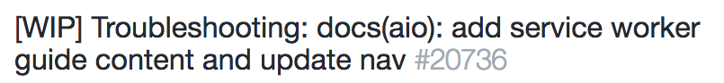
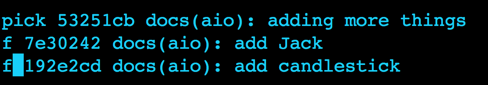

This document covers the basic scenarios you will find while contributing to Angular docs.

## Scenario 1. What is my Git workflow when I am working alone on documentation?

### Step 1: Clone the repo you want to make contrubutions to.
In Terminal:
```sh
$ git clone the-angular-repo-you-want-to-clone
```

### Step 2: Create a feature branch

* In Terminal:

``` sh 
$ git checkout -b name-of-your-new-branch
```

### Step 3: Pull latest changes from the origin to your local

```sh
$ git pull origin master
```

### Step 4: Perform your [daily work](daily-work.md#dailywork).

### Step 5: Rebase your branch.

Rebasing makes sure that you have the most recent changes that are in master in your feature branches. You do this because you want your branches to be as close as possible to the master branch with the only differences being your edits. Your branch will have to be up-to-date to merge it with the master branch. If it isn't, the owner of the repo will ask you to rebase. If you've been rebasing all along, it should be an easy task. If you haven't, it will be more involved.

The commands to rebase are:

* On master: `git pull`. 
* On your branch: `git rebase origin/master`

_Note_: `git pull` _is  two commands&mdash;a fetch and a merge. There may be times when you don't want to merge. In that case, you just do a `git fetch`, a harmless command that goes out and gets the most recent changes to the repo. You won't need to apply this knowledge right away, but the longer you work on the docs, more likely the occasion is to arise. So keep this note in the back of your mind._


#### Conflicts
Sometimes when you rebase, you'll run into conflicts. To fix them, open the file(s) specified in the conflict message in your editor and edit the files so that they include the changes you intend. 

1. Follow steps 5-7 in [this GitHub help doc](https://help.github.com/articles/resolving-a-merge-conflict-using-the-command-line/). 
2. When you've finished editing all the conflicts and saved your file(s), enter this at the command line `git rebase --continue`.

_Note: If you [squash](#squash) your commits before rebasing, you may save yourself some work. If you have, for example, 20 commits, they could all potentially cause conflicts when you attempt a merge. Git merges each commit separately, so you could get conflicts over and over as you step through. You'll feel like you're done resolving conflicts only to watch more show up as git applies the next commit. Do yourself a favor in these situations and keep your commits as few in number as possible._

### Step 6: Push back the latest commits from rebase.

Do a push --force after rebasing

```sh
$ git push --force
```

### Step 7 (Optional) : Perform a [daily shutdown](daily-shutdown.md) routine.

### <a id='PR'>Step 8: Submit a Pull Request (PR) when you're done with the work on your branch. </a>

1. Go to your repo on GitHub.
1. Click the `New Pull Request` button. There are several routes to creating a PR. This button is one. Another is in the branches tab where there is a `New Pull Request` button. If you've just pushed up, you might also see a green `New Pull Request` button. Any of these will take you to the same place 
1. For Angular, you will need to fill out the automatically generated form in the PR comments section. Fill everything out to the best of your ability. Submit the PR. 
1. To let the appropriate person or people know about your PR, you can tag them in the PR as well as let them know on slack.

### Step 7: [Clean up](clean-up-activities.md) your branch(es) after work is done .


## Scenario 2: I am working on a new file. How do I add it to the ExpertSupport/angular?

 You can add a new file by [pushing](daily-work.md#push)
  your file up to ExpertSupport/angular, which is a fork of the angular/angular repo.

## Scenario 3: As I work on a file, how do I ensure that my changes are safe and backed up?

You back up your files by regularly [pushing](daily-work.md#push) your commits to a remote repository. Commit and push cycle ensures that you can retrieve your changes even when a problem with your local repo causes loss of your work.

## Scenario 4: A Writer asked me to review his/her work, which he/she has pushed to ExpertSupport/angular. How do I do that?

### Step 1. *Clone* ExpertSupport/angular to your local.
 
 This will also add a Git remote called origin to ExpertSupport/angular.

### Step 2. Fetch and merge changes from the remote.

In terminal:
```sh
git pull origin master
```

### Step 3. Checkout your peer's working branch.

In terminal:

```sh
git checkout their-branchname
```

### Step 4. Perform a git rebase to ensure that the current checked out branch is upto date with the orgin master.

In terminal:
```sh
git rebase origin/master
```

### Step 5. Copy edit his/her work and create a commit to track those changes.

### Step 6. Push the changes back to remote.

In terminal:
```sh
git push origin their-branch name
```
_Note_: Before pushing your changes back to your peer's branch, check with him/her to make sure that they are okay with it.


## Scenario 5: How do I get my work reviewed by engineers via github?

You need to  push your changes to ExpertSupport/angular and then submit a [PR](#PR) to angular/angular repo and tag all reviewers. PR should have [WIP] prefix in title/description as shown below:




## <a id='squash'>Scenario 6: I want to clean my commit history before pushing changes or submitting a PR. How do I do that?</a>

To clean your commit history when you are done with your changes, squash them to a single commit.

To squash the last N commits into one, do the following:

### Step 1. Run the rebase command.

```sh
git rebase -i HEAD~N
```
This will open up a text editor with a file that lists all the commits in your branch. 


### Step 2. From the list of commits displayed, for every line except the first, replace the word ```pick``` with the word ```fixup``` (f). It will end up looking like this:



 ### Step 3. Save and quit the editor. 

 4. Push your changes to remote.

**Note**: If you've already pushed commits to GitHub, and then squash them locally, you will have to force the push to your branch.

```sh
$ git push origin branch-name --force
```

# Scenario 7: How do I copy edit an engineer's work

### Step1. Clone his/her forked repo.
 
 Clone their forked repo of angular/angular to your local. This will also add a Git remote called _origin_ that points back to the forked repository.

### Step 2. Fetch and merge changes from remote.

In terminal:
```sh
git pull origin master
```

### Step 3. Checkout his/her working branch.

In terminal:

```sh
git checkout their-branchname
```

### Step 4. Perform a git rebase 

This ensures that the current checked out branch is upto date with the orgin master

In terminal:
```sh
git rebase origin/master
```
### Step 5. Copy edit his work and create a commit to track those changes.

### Step 6. Push the changes back to remote.

In terminal:
```sh
git push origin their-branch name
```

**Note:** if you have write access to engineer's fork, push your change to their fork. Otherwise push to ExpertSupport/angular and submit a PR to engineer's repo.


