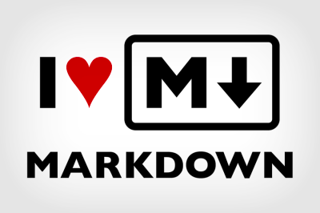

# Learn Basic Markdown Syntax

To create documentation on the GitHub platform, you need to be familiar with the basic Markdown syntax.

This page shows you few examples of using the Markdown syntax to:

* Add an image to your doc.
* Add a code block in your doc.
* Add an external link in your doc.

For a full list of all the Markdown syntax, see [Writing on GitHub](https://help.github.com/categories/writing-on-github/).

## Add an image to the document
You can add an image by wrapping alternate text in square brackets, and linking the image in paranthesis.

**Syntax**: ``

**Example**:
``

**Result**:



## Add a code block in your file
To format code into its own block, use triple backticks before and after the code block.

**Syntax**: \``` code ```

**Example**:

```
@Component({
   selector:'app-root',
   template: `
       <bs-jumbo>
         <div class="body">
         </div>
         <div class="button">
           Learn More
         </div>
       </bs-jumbo>
})
```


## Add an external link in your file

You can add an extenral link by wrapping link text in brackets [ ], and then wrapping the URL in
parentheses ( ).

**Syntax**: `[Text](http://example.com)`

Result: [Angular docs](http://angular.io/docs)

### Additional tip

You can preview your code side by side with the changes reflected in real-time using the keyboard shortcut (⌘K V). You can also use the menu option, **Command Palette** - *Markdown: Open Preview to the side*.
