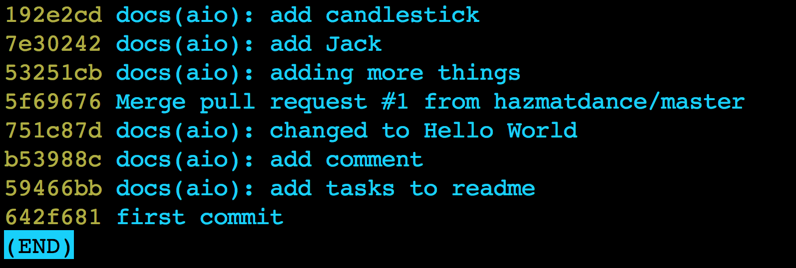
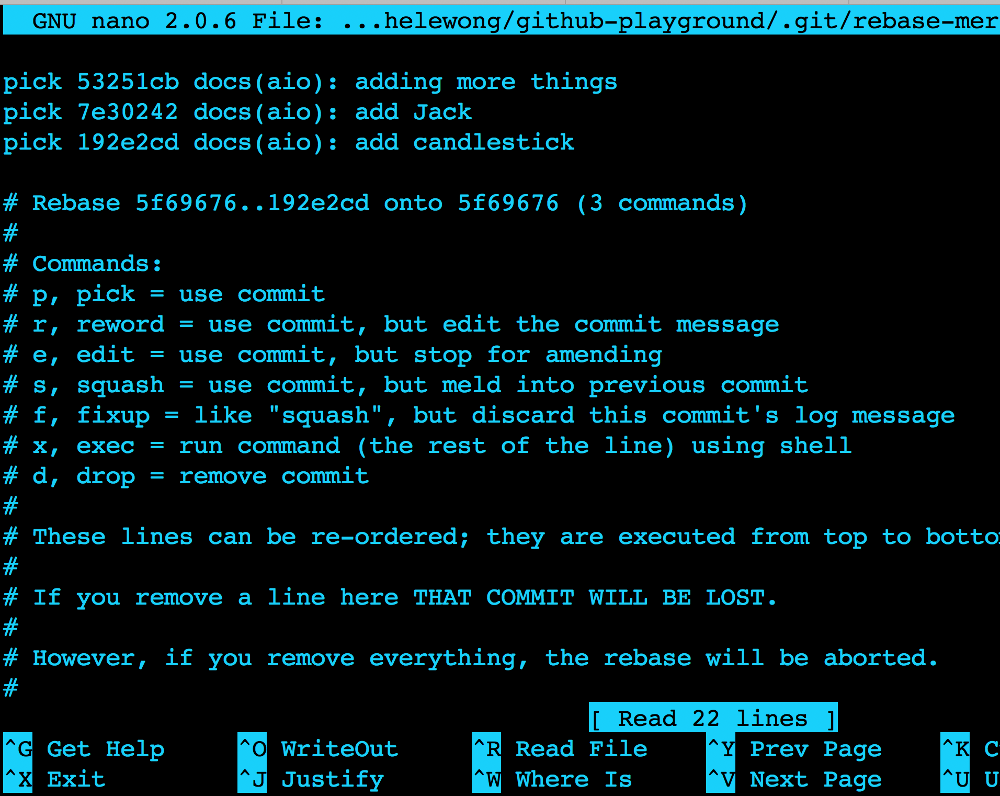
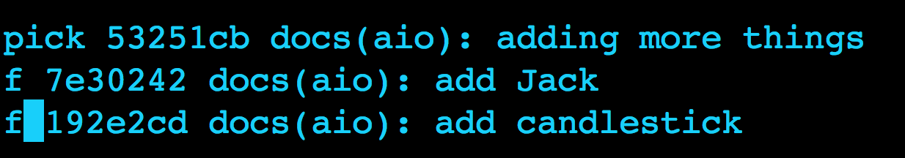
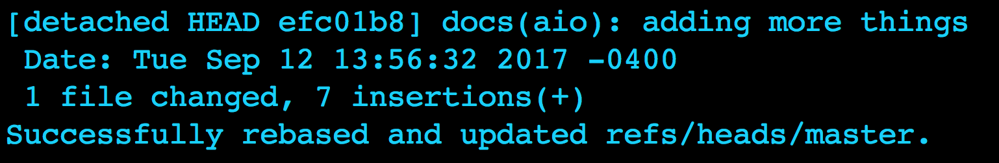
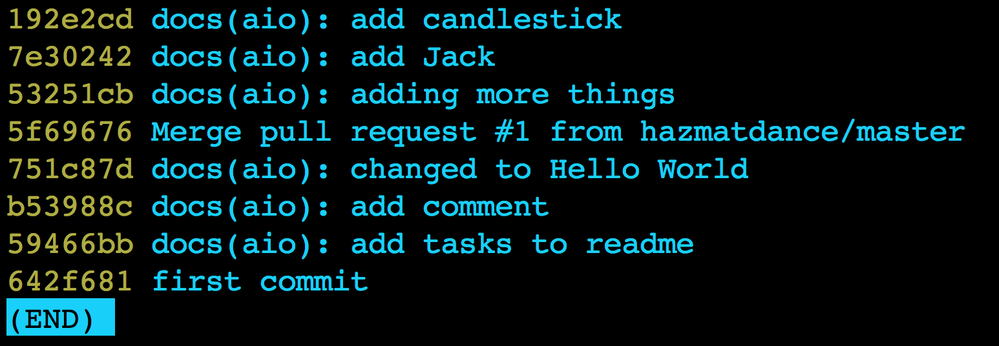

# Squashing

You only need to squash when you have multiple commits and need to collapse them. 
This is often the case when you’ve been working on a PR for a while and it’s ready to merge. 

In terminal:
1. `git rebase -i HEAD~n`, where n is the number of commits you want to squash. For example, I would like to squash the following commits, which I can see with git log --oneline: 

In this case, to squash the first three, type `git rebase -i HEAD~3`. That brings you to your default editor, in this case Nano:

1. Next, pick the first one and fixup the rest as follows:

1. This step is for Nano. Press Ctrl+X to exit. Type y for yes to the following question which will appear near the menu at the bottom: 

1. This step is for Nano. Press Enter at the next prompt that will resemble this:Here is the success message: 
 If you don’t get this success message, contact Kapunahele for help.
1. You can check that your commits were squashed with `git log --oneline`.

1. `git push` 

Undo a Squash

A hard reset in git is a forcible way to return to an earlier state, which means you can lose work if you’re not careful. If you’re unsure in this territory, please contact Kapunahele or at least back up your work. To undo a squash, do the following in the terminal:

1. `git reflog`
1. `git reset --hard HEAD@{n}`, where `n` is the number of the entry you want to go back to.

Example:
1.To undo the squash in the last section, do the following:
1. `git reflog` shows the details of the squash below (the entries with rebase -i are the commits that were squashed):
In this case, to go back to a pre-squash state, use HEAD@{4}: 
1. `git reset --hard HEAD@{2}`
1. Now git log --oneline shows you the commits as if they were never squashed: 

